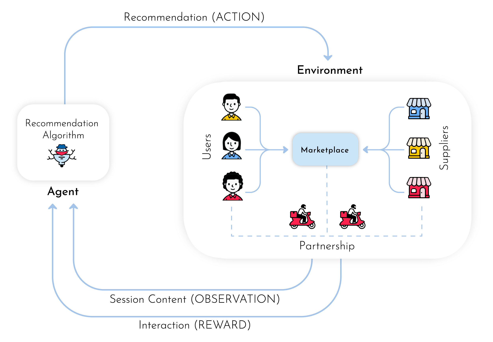

# MARS-Gym: A Gym framework to model, train, and evaluate recommendationsystems for marketplaces

Framework Code for the RecSys 2020 entitled 'MARS-Gym: A Gym framework to model, train, and evaluate recommendationsystems for marketplaces'. 



MARS-Gym(MArketplaceRecommenderSystems Gym), a benchmark framework for modeling, training, and evaluating RL-based recommender systems for marketplaces. Three main components composesthe framework. The first one is a highly customizable module where the consumer can ingest and process a massiveamount of data for learning using spark jobs. We designed the second component for training purposes. It holdsan extensible module built on top of PyTorch to design learning architectures. It also possesses an OpenAI’s Gym environment that ingests the processed dataset to run a multi-agent system that simulates the targeted marketplace. Finally, the last component is an evaluation module that provides a set of distinct perspectives on theagent’s performance. It presents not only traditional recommendation metrics but also off-policy evaluation metrics, toaccount for the bias induced from the historical data representation of marketplace dynamics. Finally, it also presentsfairness indicators to analyze the long-term impact of such recommenders in the ecosystem concerning sensitive attributes. This component is powered by a user-friendly interface to facilitate the analysis and comparison betweenagents


# Dependencies and Requirements

- python=3.6.7
- pandas=0.25.1
- pyarrow=0.15.0
- matplotlib=2.2.2
- scipy=1.3.1
- numpy=1.17.0
- seaborn=0.8.1
- scikit-learn=0.21.2
- pytorch=1.2.0
- tensorboardx=1.6
- luigi=2.7.5
- tqdm=4.33
- requests=2.18.4
- jupyterlab=1.0.2
- ipywidgets=7.5.1
- diskcache=3.0.6
- pyspark=2.4.3
- psutil=5.2.2
- category_encoders
- plotly=4.4.1
- imbalanced-learn==0.4.3
- torchbearer==0.5.1
- pytorch-nlp==0.4.1
- unidecode==1.1.1
- streamlit==0.52.2
- dask[dataframe]==2.12.0
- gym==0.15.4
- google-cloud-storage==1.26.0

## Install

```bash
conda env create -f environment.yml
conda activate deep-reco-gym
```

# Usage

### Simulate Example

```bash

PYTHONPATH="." luigi --module MODULE --project PROJECT \
--n-factors N_FACTORS --learning-rate LR --optimizer OPTIMIZER \
--epochs EPOCHS --obs-batch-size OBS_BATCH \
--batch-size BATCH_SIZE --num-episodes NUM_EP \
--bandit-policy BANDIT --bandit-policy-params BANDIT_PARAMS  

```

### Evaluate Example

```bash

PYTHONPATH="." luigi --module MODULE --model-module MODEL_MODULE \
 --model-cls MODEL_CLS --model-task-id MODEL_TASK_ID --fairness-columns "[]" \
 --direct-estimator-module DE_MODULE \
 --direct-estimator-cls DE_CLS
```

#### Evaluation Module

```bash
streamlit run tools/eval_viz/app.py
```

## Trivago Experiments

All results of the Paper can be reproduced with the scripts:

Simulate results:

```bash
./experiments/trivago/simulation/simu_como_italy.sh
./experiments/trivago/simulation/simu_chicago_usa.sh
./experiments/trivago/simulation/simu_rio_janeiro.sh
./experiments/trivago/simulation/simu_new_your.sh
./experiments/trivago/simulation/simu_recsys.sh
```

Rank and fairness metrics results can be run through the script ```./experiments/trivago/rank_metrics_chicago.sh``` or using the command:

```bash
PYTHONPATH="." luigi --module recommendation.task.model.trivago.evaluation EvaluateTrivagoTestSetPredictions \
--model-module recommendation.task.model.trivago.trivago_logistic_model \
--model-cls TrivagoLogisticModelInteraction \
--model-task-id MODEL_TASK_ID \
--fairness-columns "[\"city_idx\",\"platform_idx\",\"device_idx\"]" \
--direct-estimator-module recommendation.task.model.trivago.trivago_logistic_model \
--direct-estimator-cls TrivagoLogisticModelTraining --local-scheduler 
```


# Cite
Please cite the associated paper for this work if you use this code:


```
@article{2020mars,
  title={MARS-Gym: A Gym framework to model, train, and evaluate recommendationsystems for marketplaces},
  author={Santana, Melo, and Camargo, et al.},
  journal={},
  year={2020}
}
```

# License

Copyright ---

Licensed under the Apache License, Version 2.0 (the "License"); you may not use this file except in compliance with the License. You may obtain a copy of the License at http://www.apache.org/licenses/LICENSE-2.0

Unless required by applicable law or agreed to in writing, software distributed under the License is distributed on an "AS IS" BASIS, WITHOUT WARRANTIES OR CONDITIONS OF ANY KIND, either express or implied. See the License for the specific language governing permissions and limitations under the License.