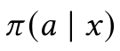
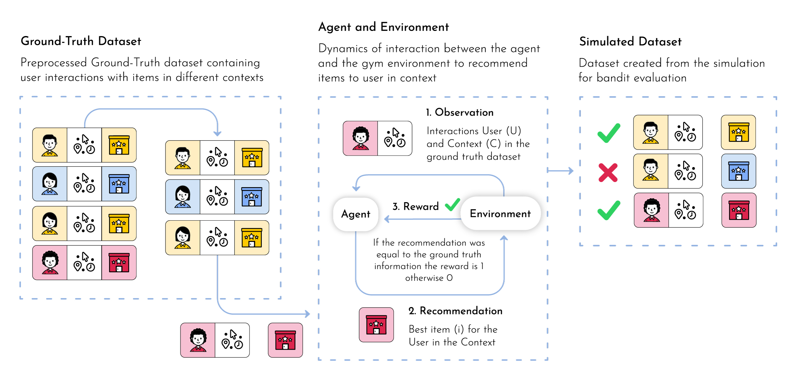
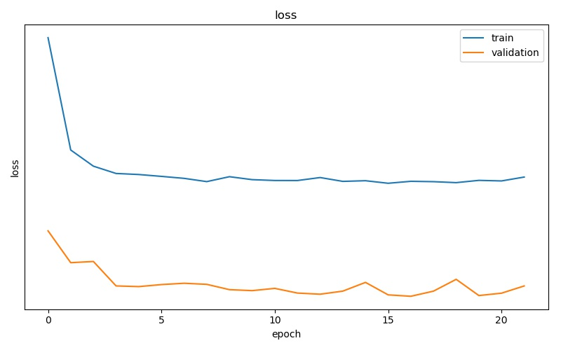
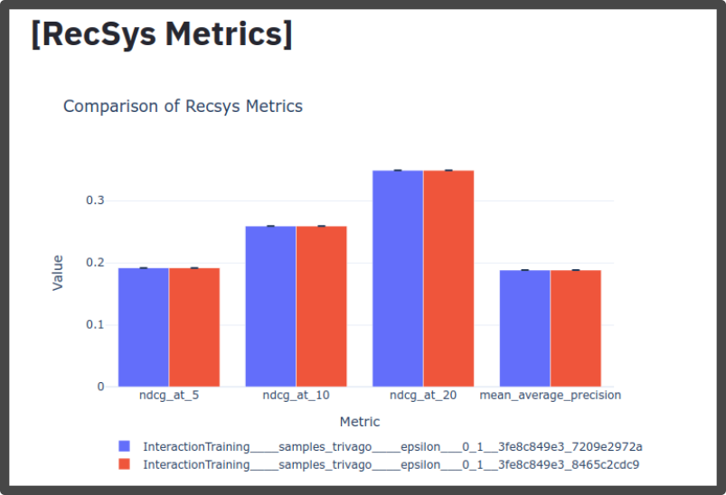
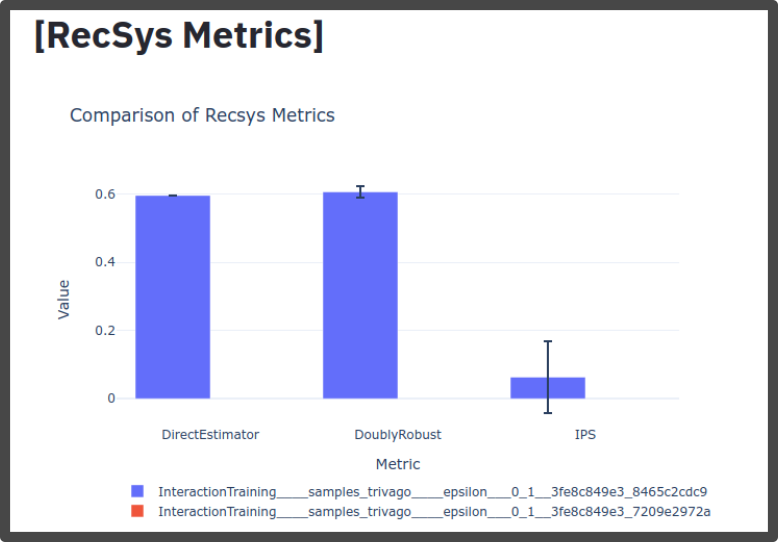
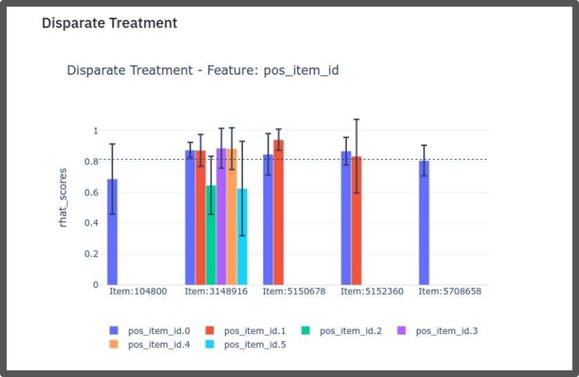
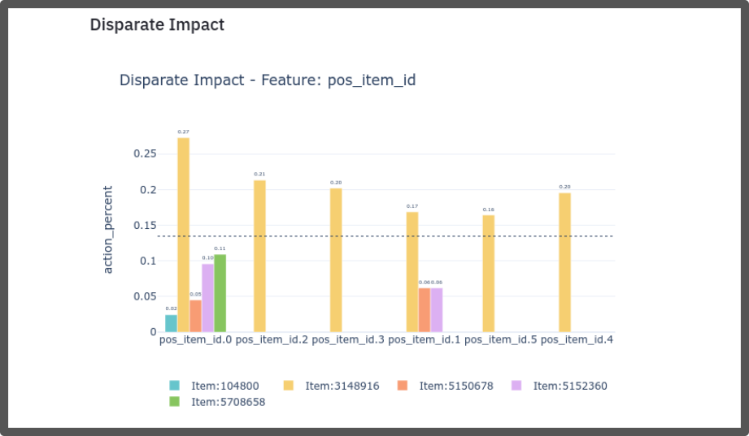
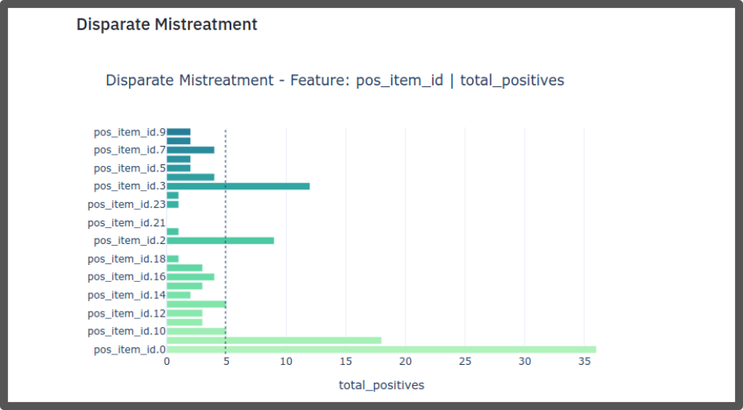
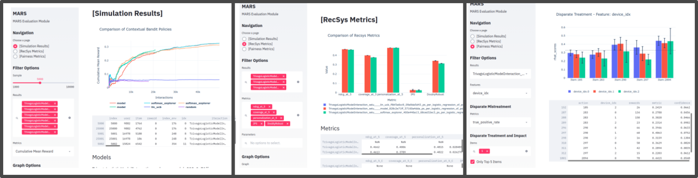

Quick Start
================================

In this tutorial we will present a simple example using MARS. Each module will be explained in a superficial way with focus on the application.

.. image:: ../images/img2.jpg
  :width: 700
  :align: center

Three main components make the framework:

* The first one is a highly customizable module where the consumer can ingest and process a massive amount of **data** for learning using spark jobs.
* The second component was designed for **training** purposes. It holds an extensible module built on top of PyTorch to design learning architectures. It also has an OpenAI Gym environment that ingests the processed dataset to simulate the targeted marketplace.
* Finally, the last component is an **evaluation** module that provides a set of distinct perspectives on the agent’s performance. It presents not only traditional recommendation metrics but also off-policy evaluations, to account for the bias induced from the historical data representation.

All code used in this guide is designed to ilustrate how each class must be implemented. They will
vary according to each project, but the consistent and necessary methods are displayed here. Some examples
can be found at the :code:`samples` folder. These are used to run our examples, so make sure this folder is
located in the same place you'll be running the commands from the following sections.

Dataset
*******

MARS provides some datasets preprocessed as examples to test the framework. They are real datasets,
which contain interaction data between users and items and the metadata of the items to be recommended.

* Trivago Dataset - http://recsys.trivago.cloud/challenge/dataset/
* Yoochose Dataset - http://2015.recsyschallenge.com/challenge.html

.. code-block:: python

  >>> from mars_gym.data import utils
  >>> utils.datasets()
  ['random',
 'yoochoose',
 'processed_yoochoose',
 'trivago_rio',
 'processed_trivago_rio']

  >>> df, df_meta = utils.load_dataset('processed_trivago_rio')
  >>> df.head()
    session_id    user_id       timestamp   action_type	      item_id	impressions                                       list_reference_item                             pos_item_id clicked
  0 05fe82b496fb9 M1Z13DD0P2KH  1541422443  clickout item     4304686	['109351', '150138', '4345728', '105014', '478'... ['', '', '', '', '']                            7           1.0
  1 05fe82b496fb9 M1Z13DD0P2KH  1541422474  clickout item     960255	['1475717', '5196406', '104880', '109351', '68'... ['4304686', '', '', '', '']                     20          1.0
  2 05fe82b496fb9 M1Z13DD0P2KH  1541423039  clickout item     2188598	['104558', '326781', '104786', '1223390', '206'... ['4304686', '960255', '', '', '']               9           1.0
  3 05fe82b496fb9 M1Z13DD0P2KH  1541424631  clickout item     8459162	['105014', '5659850', '478121', '109351', '956'... ['4304686', '960255', '2188598', '', '']        23          1.0
  4 05fe82b496fb9 M1Z13DD0P2KH  1541424685  interaction info  8459162	NaN                                                ['4304686', '960255', '2188598', '8459162', ''] -1          0.0

  >>> df_meta[['list_metadata']].head()
    list_metadata
  0 [0, 0, 0, 0, 0, 0, 0, 0, 1, 0, 0, 0, 0, 1, 0, ...
  1 [0, 0, 0, 0, 0, 0, 0, 0, 0, 0, 0, 0, 0, 0, 0, ...
  2 [0, 0, 0, 1, 0, 1, 0, 0, 1, 0, 0, 0, 1, 1, 0, ...
  3 [0, 0, 0, 0, 0, 0, 0, 1, 0, 1, 0, 1, 0, 0, 0, ...
  4 [0, 0, 0, 0, 0, 0, 0, 0, 1, 1, 0, 1, 0, 1, 0, ...

.. note::
  The :code:`load_dataset()` function will download and load only the datasets in :code:`mars_gym.data.utils.datasets()`

Prepare data
************

The Data Engineering Module is responsible for preprocessing the data and setting up interactions and metadata for
the simulation module. It uses `Luigi <https://github.com/spotify/luigi>`_ as a pipeline tool.

:code:`BasePrepareDataFrames` is the main class responsible for validating and preparing the data.

.. code-block:: python

  from mars_gym.data.utils import DownloadDataset

  class PrepareInteractionData(luigi.Task):
      def requires(self):
          return DownloadDataset(dataset="processed_trivago_rio", output_path=OUTPUT_PATH)

      def output(self):
          return luigi.LocalTarget(os.path.join(DATASET_DIR, "dataset.csv",))

      def run(self):
          os.makedirs(DATASET_DIR, exist_ok=True)

          df = pd.read_csv(self.input()[0].path)

          # .... transform dataset

          df.to_csv(self.output().path)

  class PrepareMetaData(luigi.Task):
      def requires(self):
          return DownloadDataset(dataset="processed_trivago_rio", output_path=OUTPUT_PATH)

      def output(self):
          return luigi.LocalTarget(os.path.join(DATASET_DIR, "metadata.csv",))

      def run(self):
          os.makedirs(DATASET_DIR, exist_ok=True)

          df = pd.read_csv(self.input()[1].path)

          # .... transform dataset

          df.to_csv(self.output().path, index="item_id")

The class inherited from :code:`BasePrepareDataFrames` is the one we will use from within MARS. It is necessary to implement 4 methods in this class. The :code:`timestamp_property`, which is a feature that defines the temporal order, :code:`dataset_dir`, which is the local path where the dataset will be saved, :code:`read_data_frame_path`, which is the local path of the interaction dataset and :code:`metadata_data_frame_path`, which is the local path of the metadata dataset.

.. code-block:: python

  from mars_gym.data.task import BasePrepareDataFrames

  class PrepareTrivagoDataFrame(BasePrepareDataFrames):
      def requires(self):
          return (
              PrepareInteractionData(),
              PrepareMetaData(),
          )

      @property
      def timestamp_property(self) -> str:
          return "timestamp"

      @property
      def dataset_dir(self) -> str:
          return DATASET_DIR

      @property
      def read_data_frame_path(self) -> pd.DataFrame:
          return self.input()[0].path

      @property
      def metadata_data_frame_path(self) -> Optional[str]:
          return self.input()[1].path

It is possible to test this pipeline before the simulation. Since this is a Luigi task it will give you summary about its success or failure, the commands to test are the following:

.. code-block:: python

  >>> from samples.trivago_simple.data import PrepareTrivagoDataFrame
  >>> import luigi
  >>> job = PrepareTrivagoDataFrame()
  >>> luigi.build([job], local_scheduler=True)
  ....
  INFO: Worker Worker(salt=154256821, workers=1, host=user-pc, username=user,
  pid=16527) was stopped. Shutting down Keep-Alive thread
  INFO:
  ===== Luigi Execution Summary =====

  Scheduled 4 tasks of which:
  * 4 ran successfully:
      - 1 DownloadDataset(output_path=output, dataset=processed_trivago_rio)
      - 1 PrepareInteractionData()
      - 1 PrepareMetaData()
      - 1 PrepareTrivagoDataFrame(...)

  This progress looks :) because there were no failed tasks or missing dependencies

  ===== Luigi Execution Summary =====

  >>> [o.path for o in job.output()]
  ['.../train_cc25c002c7.csv',
  '.../val_cc25c002c7.csv',
  '.../test_cc25c002c7.csv',
  '.../metadata.csv']

The :code:`BasePrepareDataFrames` is highly configurable and parameterizable. In general, the output of this job is the split and processed datasets to be used by MARS.

* `DATASET_DIR/train_cc25c002c7.csv`
* `DATASET_DIR/val_cc25c002c7.csv`
* `DATASET_DIR/test_cc25c002c7.csv`
* `DATASET_DIR/metadata.csv`

Configuration
*************

Before the simulation, we need to prepare a configuration file with the design parameters and contextual information to be used in the model. We need to define a variable as an instance of :code:`ProjectConfig`

.. code-block:: python

  from mars_gym.data.dataset import InteractionsDataset
  from mars_gym.meta_config import *
  from samples.trivago_rio import data

  trivago_rio = ProjectConfig(
      base_dir=data.BASE_DIR,
      prepare_data_frames_task=data.PrepareTrivagoDataFrame,
      dataset_class=InteractionsDataset,
      user_column=Column("user_id", IOType.INDEXABLE),
      item_column=Column("item_id", IOType.INDEXABLE),
      other_input_columns=[
          Column("pos_item_id", IOType.NUMBER),
          Column("list_reference_item", IOType.INDEXABLE_ARRAY, same_index_as="item_id"),
      ],
      metadata_columns=[Column("list_metadata", IOType.INT_ARRAY),],
      output_column=Column("clicked", IOType.NUMBER),
      available_arms_column_name="impressions"
  )

* :code:`base_dir`: Local path where the dataset and files generated by the data engineer module will be saved
* :code:`prepare_data_frames_task`: Class inherited from BasePrepareDataFrames. This defines the data engineer pipeline.
* :code:`dataset_class`: This class defines how the dataset will be used in the simulation module. MARS already implements different types.
* :code:`user_column`: Column that identifies the user
* :code:`item_column`: Column that identifies the item
* :code:`other_input_columns`: Columns that will be used as input for the model and context
* :code:`metadata_columns`: Metadata columns that will be used as input for the model and context
* :code:`output_column`: Reward column, the column that defines wether the recommendation was sucessful or not
* :code:`available_arms_column_name`: Name of the column with items available for recommendation at the time of interaction. This column must contain a list of items the same type as :code:`item_column`. If this information is not available, MARS will randomly generate the items.

.. note::
  We recommend creating a `config.py` file with all project definitions. It is common to have several different configurations to experiment.

Model and Simulation
********************

The Recommendation Agent is composed of Reward Estimator and a Recommendation Policy. The model is trained using the rewards from the environment and the policy chooses actions (recommendations) using the context received, again, from the environment.

Reward Estimator
################

In order to implement a Reward Estimator ρ(x, a) we use a Pytorch Model that will estimate a reward in a contextual bandit problem. It uses the context 'x' (all information passed from environment) and the available actions 'a' to estimate a reward for each action.

.. .. image:: ../images/math_reward_estimator.png
..   :width: 300
..   :align: center

Model
#####

The model needs to inherit from RecommenderModule. This class receives through its constructor the :code:`ProjectConfig` and a :code:`Dict`  with IndexMapping for all categorical variables. The model is a Pytorch :code:`nn.Module` and receives in the foward function all context defined in :code:`ProjectConfig` (:code:`user_column`, :code:`item_column`, :code:`other_input_columns`, and :code:`metadata_columns`).

.. code-block:: python

  import luigi
  from typing import Dict, Any
  import torch
  import torch.nn as nn
  from mars_gym.meta_config import ProjectConfig
  from mars_gym.model.abstract import RecommenderModule

  class SimpleLinearModel(RecommenderModule):
      def __init__(
          self,
          project_config: ProjectConfig,
          index_mapping: Dict[str, Dict[Any, int]],
      ):
        """
        build model architecture
        """
        super().__init__(project_config, index_mapping)
        #...

      def forward(
          self,
          user_ids: torch.Tensor,
          item_ids: torch.Tensor,
          pos_item_id: torch.Tensor,
          list_reference_item: torch.Tensor,
          list_metadata: torch.Tensor,
      ):
        """
        build forward
        """
        pass

This model will be trained using the Counterfactual Risk Minimization (CRM) [`1 <https://www.cs.cornell.edu/people/tj/publications/swaminathan_joachims_15b.pdf>`_] to reduce bias that came from the dataset. Everything about this training can be parameterized and easily altered.

.. .. image:: ../images/math_crm_loss.png
..   :width: 400
..   :align: center

* [`1 <https://www.cs.cornell.edu/people/tj/publications/swaminathan_joachims_15b.pdf>`_] Adith Swaminathan and Thorsten Joachims. 2015. Counterfactual Risk Minimization: Learning from Logged Bandit Feedback. In Proceedings of the 32nd International Conference on International Conference on Machine Learning - Volume 37 (Lille, France) (ICML’15). JMLR.org, 814–823.

**Model Example**

This is an example of a simple linear model used in the trivago samples:

.. code-block:: python

  class SimpleLinearModel(RecommenderModule):
      def __init__(
          self,
          project_config: ProjectConfig,
          index_mapping: Dict[str, Dict[Any, int]],
          n_factors: int,
          metadata_size: int,
          window_hist_size: int,
      ):
          super().__init__(project_config, index_mapping)

          self.user_embeddings = nn.Embedding(self._n_users, n_factors)
          self.item_embeddings = nn.Embedding(self._n_items, n_factors)

          # user + item + flatten hist + position + metadata
          num_dense = 2 * n_factors + window_hist_size * n_factors + 1 + metadata_size

          self.dense = nn.Sequential(
              nn.Linear(num_dense, 500), nn.SELU(), nn.Linear(500, 1),
          )

      def flatten(self, input: torch.Tensor):
          return input.view(input.size(0), -1)

      def forward(
          self,
          user_ids: torch.Tensor,
          item_ids: torch.Tensor,
          pos_item_id: torch.Tensor,
          list_reference_item: torch.Tensor,
          list_metadata: torch.Tensor,
      ):
          user_emb = self.user_embeddings(user_ids)
          item_emb = self.item_embeddings(item_ids)
          history_items_emb = self.item_embeddings(list_reference_item)

          x = torch.cat(
              (
                  user_emb,
                  item_emb,
                  self.flatten(history_items_emb),
                  pos_item_id.float().unsqueeze(1),
                  list_metadata.float(),
              ),
              dim=1,
          )

          x = self.dense(x)
          return torch.sigmoid(x)

Recommendation Policy
#####################

We need to implement a Recommendation Policy π(a|x), this is a bandit strategy 'π' that will choose an action 'a' based on the context 'x'.

**Bandit**

The Bandit needs to be inherited from BanditPolicy. We need to implement the :code:`._select_idx(...)` function. This method is called by the environment to receive an action given the context.

.. code-block:: python

  from mars_gym.model.bandit import BanditPolicy
  from typing import Dict, Any, List, Tuple, Union

  class BasePolicy(BanditPolicy):
      def __init__(self, reward_model: nn.Module, seed: int = 42):
          """
          Initialize bandit information and params
          """
          super().__init__(reward_model)

      def _select_idx(
          self,
          arm_indices: List[int],
          arm_contexts: Tuple[np.ndarray, ...] = None,
          arm_scores: List[float] = None,
          pos: int = 0,
      ) -> Union[int, Tuple[int, float]]:
          """
          Choose the index of arm selected in turn
          """

          return action

* :code:`arm_indices`: Available actions at the time of interaction (same as :code:`available_arms_column_name`)
* :code:`arm_contexts`: Context information at the time of interaction
* :code:`arm_scores`: Estimated reward, that came from Reward Estimator, for each action.

**Example of Epsilon-Greedy Policy**

.. code-block:: python

  class EGreedyPolicy(BanditPolicy):
      def __init__(self, reward_model: nn.Module, seed: int = 42):
          super().__init__(reward_model)
          self._rng = RandomState(seed)

      def _select_idx(
          self,
          arm_indices: List[int],
          arm_contexts: Tuple[np.ndarray, ...] = None,
          arm_scores: List[float] = None,
          pos: int = 0,
      ) -> Union[int, Tuple[int, float]]:

          n_arms = len(arm_indices)
          arm_probas = np.ones(n_arms) / n_arms

          if self._rng.choice([True, False], p=[self._epsilon, 1.0 - self._epsilon]):
              action = self._rng.choice(len(arm_indices), p=arm_probas)
          else:
              action = int(np.argmax(arm_scores))

          return action

Simulation
##########

MARS-Gym simulates the dynamics of the marketplace. This includes several processes.
The framework filters only successful interactions. They are the only ones that
tell us what the users really want, thus they are used to compose the rewards. Each
simulation step is an interaction, with observations being the user's metadata, and
actions being the items to recommend. The sequence of steps follows the sequence of
interactions in the filtered ground-truth dataset to maintain the temporal dynamic.
Finally, the interactions between the proposed agent and the environment generate
new interaction logs that are used in subsequent steps.

For simulation, we use the :code:`InteractionTraining` class. This class is a Gym implementation and receives as parameters the information about the project (:code:`ProjectConfig`), reward estimator (:code:`RecommenderModule`), bandit policy (:code:`BanditPolicy`) and other training parameters.

.. code-block:: python

  >>> from mars_gym.simulation.interaction import InteractionTraining
  >>>
  >>> job_train = InteractionTraining(
  >>>     project="samples.trivago_simple.config.trivago_rio",
  >>>     recommender_module_class="samples.trivago_simple.simulation.SimpleLinearModel",
  >>>     recommender_extra_params={
  >>>         "n_factors": 10,
  >>>         "metadata_size": 148,
  >>>         "window_hist_size": 5,
  >>>     },
  >>>     bandit_policy_class="samples.trivago_simple.simulation.EGreedyPolicy",
  >>>     bandit_policy_params={
  >>>         "epsilon": 0.1,
  >>>         "seed": 42
  >>>     },
  >>>     test_size=0.1,
  >>>     obs_batch_size=100,
  >>>     num_episodes=1,
  >>> )
  >>>
  >>> luigi.build([job_train], local_scheduler=True)
  ...
  ...
  0/100(t): 100%|████████████████████████████████████████████████████████████████████████████████████████| 12/12 [00:00<00:00, 30.32it/s, loss=0.0025, running_loss=0.0024]
  1/100(t): 100%|█████████████████████████████████████████████████████████████████████████████████████████| 12/12 [00:00<00:00, 45.82it/s, loss=0.003, running_loss=0.0028]
  ...
  ...
  10/100(v): 100%|██████████████████████████████████████████████████████████████████████████████████████████████████████████| 3/3 [00:00<00:00, 81.10it/s, val_loss=0.2949]

  Interaction Stats (75.36%)
            count      mean       std
  dataset
  all      7300.0  0.044110  0.205353
  train    5840.0  0.042808  0.202442
  valid    1460.0  0.049315  0.216599

  Saving logs...
  Saving test set predictions...
  100%|███████████████████████████████████████████████████████████████████████████████████████████████████████████████████████████| 2422/2422 [00:00<00:00, 4063441.72it/s]
  100%|███████████████████████████████████████████████████████████████████████████████████████████████████████████████████████████| 2422/2422 [00:00<00:00, 3831989.55it/s]
  100%|███████████████████████████████████████████████████████████████████████████████████████████████████████████████████████████████| 2422/2422 [00:16<00:00, 151.33it/s]

  INFO: Informed scheduler that task   InteractionTraining____samples_trivago____epsilon___0_1__4fc1370d9d   has status   DONE
  2020-06-22 08:41:37,842 : INFO : Informed scheduler that task   InteractionTraining____samples_trivago____epsilon___0_1__4fc1370d9d   has status   DONE
  DEBUG: Asking scheduler for work...

The best way to run is in **Script Mode**:

.. code-block:: console

  $ mars-gym run interaction \
  --project samples.trivago_simple.config.trivago_rio \
  --recommender-module-class samples.trivago_simple.simulation.SimpleLinearModel \
  --recommender-extra-params '{"n_factors": 10, "metadata_size": 148, "window_hist_size": 5}' \
  --bandit-policy-class samples.trivago_simple.simulation.EGreedyPolicy \
  --bandit-policy-params '{"epsilon": 0.1}' \
  --obs-batch-size 100

  ...
  ...
  Interaction Stats (75.36%)
            count      mean       std
  dataset
  all      7300.0  0.044110  0.205353
  train    5840.0  0.042808  0.202442
  valid    1460.0  0.049315  0.216599

  Saving logs...
  Saving test set predictions...
  100%|███████████████████████████████████████████████████████████████████████████████████████████████████████████████████████████| 2422/2422 [00:00<00:00, 4063441.72it/s]
  100%|███████████████████████████████████████████████████████████████████████████████████████████████████████████████████████████| 2422/2422 [00:00<00:00, 3831989.55it/s]
  100%|███████████████████████████████████████████████████████████████████████████████████████████████████████████████████████████████| 2422/2422 [00:16<00:00, 151.33it/s]

  INFO: Informed scheduler that task   InteractionTraining____samples_trivago____epsilon___0_1__4fc1370d9d   has status   DONE
  2020-06-22 08:41:37,842 : INFO : Informed scheduler that task   InteractionTraining____samples_trivago____epsilon___0_1__4fc1370d9d   has status   DONE
  DEBUG: Asking scheduler for work...

.. note::
  Make sure you have downloaded the dataset to be processed. In this script specifically, we are using the "processed_trivago_rio" dataset

Each simulation generates artifacts for evaluation and metadata that can be used to deploy models in another environment:

* ../params.json
* ../sim-datalog.csv
* ../index_mapping.pkl
* ../bandit.pkl
* ../weights.pt
* ../test_set_predictions.csv

Supervised Learning
###################

It is also possible to use MARS-gym for supervised learning. It is useful for validating and testing the reward model before using it in a simulation. In such cases, we can use :code:`SupervisedModelTraining` class with similar parameters.

.. code-block:: console

  $ mars-gym run supervised \
  --project samples.trivago_simple.config.trivago_rio \
  --recommender-module-class samples.trivago_simple.simulation.SimpleLinearModel \
  --recommender-extra-params '{"n_factors": 10, "metadata_size": 148, "window_hist_size": 5}' \
  --early-stopping-min-delta 0.0001 --negative-proportion 0.8 \
  --learning-rate 0.0001 --epochs 50 --batch-size 100 --metrics='["loss"]'

  ...
  ...
  DEBUG: Checking if SupervisedModelTraining(project=samples.trivago_simple.config.trivago_rio,
  sample_size=-1, minimum_interactions=5, session_test_size=0.1, test_size=0.2,
  dataset_split_method=time, test_split_type=random, val_size=0.2, n_splits=5,
  split_index=0, data_frames_preparation_extra_params={}, sampling_strategy=none,
  balance_fields=[], sampling_proportions={}, use_sampling_in_validation=False, eq_filters={},
  neq_filters={}, isin_filters={}, seed=42, observation=, negative_proportion=0.8,
  recommender_module_class=samples.trivago_simple.simulation.SimpleLinearModel,
  recommender_extra_params={"n_factors": 10, "metadata_size": 148, "window_hist_size": 5},
  device=cuda, batch_size=100, epochs=50, optimizer=adam, optimizer_params={},
  learning_rate=0.0001, loss_function=mse, loss_function_params={}, gradient_norm_clipping=0.0,
  gradient_norm_clipping_type=2, early_stopping_patience=5, early_stopping_min_delta=0.0001,
  monitor_metric=val_loss, monitor_mode=min, generator_workers=0, pin_memory=False,
  policy_estimator_extra_params={}, metrics=["loss"], bandit_policy_class=mars_gym.model.bandit.ModelPolicy,
  bandit_policy_params={}) is complete
  ...
  20/50(t): 100%|████████████████████████████████████████████████████████████████| 388/388 [00:01<00:00, 242.70it/s, loss=0.129, running_loss=0.1277]
  20/50(v): 100%|███████████████████████████████████████████████████████████████████████████████████| 97/97 [00:00<00:00, 323.86it/s, val_loss=0.125]
  21/50(t): 100%|████████████████████████████████████████████████████████████████| 388/388 [00:01<00:00, 201.85it/s, loss=0.1291, running_loss=0.129]
  21/50(v): 100%|██████████████████████████████████████████████████████████████████████████████████| 97/97 [00:00<00:00, 323.73it/s, val_loss=0.1252]
  Saving test set predictions...
  100%|█████████████████████████████████████████████████████████████████████████████████████████████████████| 2422/2422 [00:00<00:00, 3655489.13it/s]
  100%|█████████████████████████████████████████████████████████████████████████████████████████████████████| 2422/2422 [00:00<00:00, 3219842.88it/s]
  100%|█████████████████████████████████████████████████████████████████████████████████████████████████████████| 2422/2422 [00:13<00:00, 181.27it/s]
  ...

-------------------------------------

Evaluation
**********

We have a specific command for evaluation. This task implements three rating categories: Rank Metrics, Fairness Metrics, and Off-policy Metrics. Before the evaluation, it is
necessary to run a simulation or supervised training, after this we will use the :code:`task_id` provided by luigi, and also used as the folder name in
:code:`output/interaction/InteractionTraining/results/task_id`. For evaluation, we use the :code:`mars-gym evaluate` command, which has the :code:`mars-gym evaluate interaction` and
:code:`mars-gym evaluate supervised` variants.

Each evaluation command generates many artifacts with metrics and metadata that can be used by the Evaluation Platform.

* EVALUATION_DIR/metrics.json
* EVALUATION_DIR/rank_metrics.csv
* EVALUATION_DIR/df_offpolicy.csv
* EVALUATION_DIR/fairness_df.csv
* EVALUATION_DIR/fairness_metrics.csv

Rank Metrics
############

By default, every run of :code:`mars-gym evaluate` will compute Rank Metrics, such as:

* nDCG
* Mean Average Precision

.. code-block:: console

  $ mars-gym evaluate interaction \
  --model-task-id InteractionTraining____samples_trivago____epsilon___0_1__3fe8c849e3

Notice that each evaluation command will receive its own :code:`task_id` preceded by the training's :code:`task_id`.

Off-policy Metrics
##################

For off-policy evaluation, MARS-Gym uses three main estimators [`3 <https://dl.acm.org/doi/10.5555/3104482.3104620>`_]:

* Direct Method
* Inverse Propensity Score
* Doubly Robust

All of which can be seen and compared with our Evaluation Platform.

In order to run these metrics, just add the flag :code:`--offpolicy-eval` to the command:

.. code-block:: console

  $ mars-gym evaluate interaction \
  --model-task-id InteractionTraining____samples_trivago____epsilon___0_1__3fe8c849e3 \
  --offpolicy-eval

[`3 <https://dl.acm.org/doi/10.5555/3104482.3104620>`_] Miroslav Dudík, John Langford, and Lihong Li. 2011. Doubly Robust Policy Evaluation and Learning. InProceedings of the 28th InternationalConference on International Conference on Machine Learning(Bellevue, Washington, USA)(ICML’11). Omnipress, Madison, WI, USA, 1097–1104.

Fairness Metrics
################

In MARS-Gym, we consider three perspectives to measure fairness [`2 <https://doi.org/10.1145/3038912.3052660>`_]:

* **Disparate Treatment**

* **Disparate Impact**

* **Disparate Mistreatment**

To calculate the metrics of fairness, you need to pass the parameter
:code:`--fairness-columns`, this parameter receives an array of attributes according to
which the metrics will be computed. Ex:

.. code-block:: console

  $ mars-gym evaluate interaction \
  --model-task-id InteractionTraining____samples_trivago____epsilon___0_1__3fe8c849e3 \
  --fairness-columns '["pos_item_id"]'

[`2 <https://doi.org/10.1145/3038912.3052660>`_] Zafar et. al, 2017. Fairness Beyond Disparate Treatment & Disparate Impact: Learning
Classification without Disparate Mistreatment https://doi.org/10.1145/3038912.3052660

Evaluation Platform
###################

The Evaluation Platform is a web application that centralizes all views of the evaluation metrics.

It is an external service made with `Streamlit <https://www.streamlit.io/>`_ library. To start the service, use this command:

.. code-block:: console

  $ mars-gym viz

  You can now view your Streamlit app in your browser.
  Local URL: http://localhost:8501

In this platform you'll be able to select experiments, metrics, and visualize them in a number of ways, including the iteraction results from training.

.. .. image:: ../images/dataviz/image2.png
..   :width: 700

