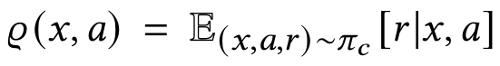
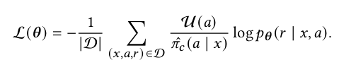
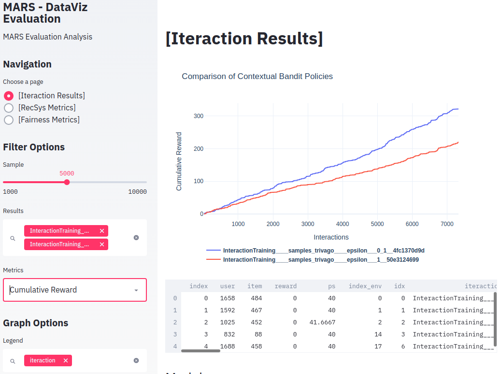

Quick Start
================================

In this tutorial we will present a simple example of using MARS. Each module will be explained in a simple and superficial way with a focus on the application.

.. image:: ../../images/img2.jpg
  :width: 700
  :align: center

Three main components composes the framework. The first one is a highly customizable module where the consumer can ingest and process a massive amount of data for learning using spark jobs. The second component was designed for training purposes. It holds an extensible module built on top of PyTorch to design learning architectures. It also possesses an OpenAI’s Gym environment that ingests the processed dataset to run a multi-agent system that simulates the targeted marketplace.
Finally, the last component is an evaluation module that provides a set of distinct perspectives on the agent’s performance. It presents not only traditional  ecommendation metrics but also off-policy evaluation metrics, to account for the bias induced from the historical data representation of marketplace dynamics

Dataset
*******

MARS provides some datasets already processed to be used as examples to test the framework. They are real datasets, which contain interaction data between users and items and the metadata of the items to be recommended.

* [1] Trivago Dataset - https://recsys.trivago.cloud/challenge/dataset/
* [2] Yoochose Dataset - https://2015.recsyschallenge.com/challenge.html

.. code-block:: python

  >>> from mars_gym.data import utils
  >>> utils.datasets()
  ['random',
 'yoochoose',
 'processed_yoochoose',
 'trivago_rio',
 'processed_trivago_rio']

  >>> df, df_meta = utils.load_dataset('processed_trivago_rio')
  >>> df.head()
    session_id    user_id       timestamp   action_type	      item_id	impressions                                       list_reference_item                             pos_item_id clicked
  0 05fe82b496fb9 M1Z13DD0P2KH  1541422443  clickout item     4304686	['109351', '150138', '4345728', '105014', '478'... ['', '', '', '', '']                            7           1.0
  1 05fe82b496fb9 M1Z13DD0P2KH  1541422474  clickout item     960255	['1475717', '5196406', '104880', '109351', '68'... ['4304686', '', '', '', '']                     20          1.0
  2 05fe82b496fb9 M1Z13DD0P2KH  1541423039  clickout item     2188598	['104558', '326781', '104786', '1223390', '206'... ['4304686', '960255', '', '', '']               9           1.0
  3 05fe82b496fb9 M1Z13DD0P2KH  1541424631  clickout item     8459162	['105014', '5659850', '478121', '109351', '956'... ['4304686', '960255', '2188598', '', '']        23          1.0
  4 05fe82b496fb9 M1Z13DD0P2KH  1541424685  interaction info  8459162	NaN                                                ['4304686', '960255', '2188598', '8459162', ''] -1          0.0

  >>> df_meta[['list_metadata']].head()
    list_metadata
  0 [0, 0, 0, 0, 0, 0, 0, 0, 1, 0, 0, 0, 0, 1, 0, ...
  1 [0, 0, 0, 0, 0, 0, 0, 0, 0, 0, 0, 0, 0, 0, 0, ...
  2 [0, 0, 0, 1, 0, 1, 0, 0, 1, 0, 0, 0, 1, 1, 0, ...
  3 [0, 0, 0, 0, 0, 0, 0, 1, 0, 1, 0, 1, 0, 0, 0, ...
  4 [0, 0, 0, 0, 0, 0, 0, 0, 1, 1, 0, 1, 0, 1, 0, ...

Prepare data
************

The Data Enginnering Module uses luigi as a data pipeline tool. Using luigi's tasks it is possible to make different transformations in the data before being used by :code:`BasePrepareDataFrames`, the class responsible for validating and preparing the data for MARS.

.. code-block:: python

  from mars_gym.data.utils import DownloadDataset

  class PrepareInteractionData(luigi.Task):
      def requires(self):
          return DownloadDataset(dataset="processed_trivago_rio", output_path=OUTPUT_PATH)

      def output(self):
          return luigi.LocalTarget(os.path.join(DATASET_DIR, "dataset.csv",))

      def run(self):
          os.makedirs(DATASET_DIR, exist_ok=True)

          df = pd.read_csv(self.input()[0].path)

          # .... transform dataset

          df.to_csv(self.output().path)

  class PrepareMetaData(luigi.Task):
      def requires(self):
          return DownloadDataset(dataset="processed_trivago_rio", output_path=OUTPUT_PATH)

      def output(self):
          return luigi.LocalTarget(os.path.join(DATASET_DIR, "metadata.csv",))

      def run(self):
          os.makedirs(DATASET_DIR, exist_ok=True)

          df = pd.read_csv(self.input()[1].path)

          # .... transform dataset

          df.to_csv(self.output().path, index="item_id")

The class inherited from BasePrepareDataFrames is the one we will use within MARS. It is necessary to implement 4 methods in this class. The :code:`timestamp_property`, which is feature that defines the temporal order, :code:`dataset_dir`, which is local path where the dataset will be saved, :code:`read_data_frame_path`, which is local path of the interaction dataset and :code:`metadata_data_frame_path`, which is local path of the metadata dataset.

.. code-block:: python

  from mars_gym.data.task import BasePrepareDataFrames

  class PrepareTrivagoDataFrame(BasePrepareDataFrames):
      def requires(self):
          return (
              PrepareInteractionData(),
              PrepareMetaData(),
          )

      @property
      def timestamp_property(self) -> str:
          return "timestamp"

      @property
      def dataset_dir(self) -> str:
          return DATASET_DIR

      @property
      def read_data_frame_path(self) -> pd.DataFrame:
          return self.input()[0].path

      @property
      def metadata_data_frame_path(self) -> Optional[str]:
          return self.input()[1].path

It is possible to test this pipeline before the simulation. This is a luigi task, so the commands are the same.

.. code-block:: python

  >>> job = PrepareTrivagoDataFrame()
  PrepareTrivagoDataFrame(session_test_size=0.1, test_size=0.2, sample_size=-1,
  minimum_interactions=5, dataset_split_method=time, column_stratification=None,
  test_split_type=random, n_splits=10, split_index=0, val_size=0.2,
  sampling_strategy=none, balance_fields=[], sampling_proportions={},
  use_sampling_in_validation=False, eq_filters={}, neq_filters={},
  isin_filters={}, seed=42)

  >>> luigi.build([job], local_scheduler=True)
  ....
  INFO: Worker Worker(salt=154256821, workers=1, host=marlesson-pc, username=marlesson,
  pid=16527) was stopped. Shutting down Keep-Alive thread
  INFO:
  ===== Luigi Execution Summary =====

  Scheduled 4 tasks of which:
  * 4 ran successfully:
      - 1 DownloadDataset(output_path=output, dataset=processed_trivago_rio)
      - 1 PrepareInteractionData()
      - 1 PrepareMetaData()
      - 1 PrepareTrivagoDataFrame(...)

  This progress looks :) because there were no failed tasks or missing dependencies

  ===== Luigi Execution Summary =====

  >>> [o.path for o in job.output()]
  ['.../train_cc25c002c7.csv',
  '.../val_cc25c002c7.csv',
  '.../test_cc25c002c7.csv',
  '.../metadata.csv']

The :code:`BasePrepareDataFrames` is highly configurable and parameterizable. In general, the output of this job is the split and processed dataset to be used by MARS.

* `DATASET_DIR/train_cc25c002c7.csv`
* `DATASET_DIR/val_cc25c002c7.csv`
* `DATASET_DIR/test_cc25c002c7.csv`
* `DATASET_DIR/metadata.csv`

Configuration
*************

Before the simulation, we need to prepare a configuration file with design parameters and contextual information that will be used in the model. We need to define a variable with an instance of :code:`ProjectConfig`

.. code-block:: python

  from mars_gym.data.dataset import InteractionsDataset
  from mars_gym.meta_config import *
  from samples.trivago_rio import data

  trivago_rio = ProjectConfig(
      base_dir=data.BASE_DIR,
      prepare_data_frames_task=data.PrepareTrivagoDataFrame,
      dataset_class=InteractionsDataset,
      user_column=Column("user_id", IOType.INDEXABLE),
      item_column=Column("item_id", IOType.INDEXABLE),
      other_input_columns=[
          Column("pos_item_id", IOType.NUMBER),
          Column("list_reference_item", IOType.INDEXABLE_ARRAY, same_index_as="item_id"),
      ],
      metadata_columns=[Column("list_metadata", IOType.INT_ARRAY),],
      output_column=Column("clicked", IOType.NUMBER),
      available_arms_column_name="impressions"
  )

* :code:`base_dir`: Local path where the dataset and files generated by the data enginner module will be saved
* :code:`prepare_data_frames_task`: Class inherited from BasePrepareDataFrames. This defines the data enginner pipeline.
* :code:`dataset_class`: This class defines how the dataset will be used in the simulation module. MARS already implements different types.
* :code:`user_column`: Name of the column that identifies the user
* :code:`item_column`: Name of the column that identifies the item
* :code:`other_input_columns`: Name of the columns that will be used as input in the model and in the context
* :code:`metadata_columns`: Name of the metadata columns that will be used as input to the model and context
* :code:`output_column`: Nome of the reward column
* :code:`available_arms_column_name`: Column name with items available for recommendation at the time of interaction. If this information is not available, MARS will randomly generate the items.

.. note::
  We recommend creating a `config.py` file with all project definitions. It is common to have several different definitions.

Model and Simulation
********************

The Recommendation Agent is composed of Reward Estimator and a Policy Recommendation. The model is trained using the rewards send from the environment and the policy needs to choose actions using the context send from the environment.

Reward Estimator
################

We need implement a Reward Estimator ρ(x, a), this is a Pytorch Model that will estimator a reward in a contextual bandit problem. It uses the context 'x' (all information passed from environment) and the available actions 'a' to estimate a reward for each action.

**Model**

The model need inherited from RecommenderModule. It class provider the :code:`ProjectConfig` and a :code:`Dict`  with IndexMapping for all category variables. The model is a Pytorch :code:`nn.module` and receive in the foward function all context defined in :code:`ProjectConfig` (:code:`user_column`, :code:`item_column`, :code:`other_input_columns`, and :code:`metadata_columns`).

.. code-block:: python

  import luigi
  from typing import Dict, Any
  import torch
  import torch.nn as nn
  from mars_gym.meta_config import ProjectConfig
  from mars_gym.model.abstract import RecommenderModule

  class SimpleLinearModel(RecommenderModule):
      def __init__(
          self,
          project_config: ProjectConfig,
          index_mapping: Dict[str, Dict[Any, int]],
      ):
        """
        build model architecture
        """
        super().__init__(project_config, index_mapping)
        #...

      def forward(
          self,
          user_ids: torch.Tensor,
          item_ids: torch.Tensor,
          pos_item_id: torch.Tensor,
          list_reference_item: torch.Tensor,
          list_metadata: torch.Tensor,
      ):
        """
        build forward
        """
        pass

This model will be trained using the Counterfactual Risk Minimization (CRM) [3] to reduce bias that came from the dataset. Everything on this train can be parameterized and changed easily.

* [3] Adith Swaminathan and Thorsten Joachims. 2015. Counterfactual Risk Minimization: Learning from Logged Bandit Feedback. In Proceedings of the 32nd International Conference on International Conference on Machine Learning - Volume 37 (Lille, France) (ICML’15). JMLR.org, 814–823.

**Model Example**

This is an example of a simple linear model used in trivago samples:

.. code-block:: python

  class SimpleLinearModel(RecommenderModule):
      def __init__(
          self,
          project_config: ProjectConfig,
          index_mapping: Dict[str, Dict[Any, int]],
          n_factors: int,
          metadata_size: int,
          window_hist_size: int,
      ):
          super().__init__(project_config, index_mapping)

          self.user_embeddings = nn.Embedding(self._n_users, n_factors)
          self.item_embeddings = nn.Embedding(self._n_items, n_factors)

          # user + item + flatten hist + position + metadata
          num_dense = 2 * n_factors + window_hist_size * n_factors + 1 + metadata_size

          self.dense = nn.Sequential(
              nn.Linear(num_dense, 500), nn.SELU(), nn.Linear(500, 1),
          )

      def flatten(self, input: torch.Tensor):
          return input.view(input.size(0), -1)

      def forward(
          self,
          user_ids: torch.Tensor,
          item_ids: torch.Tensor,
          pos_item_id: torch.Tensor,
          list_reference_item: torch.Tensor,
          list_metadata: torch.Tensor,
      ):
          user_emb = self.user_embeddings(user_ids)
          item_emb = self.item_embeddings(item_ids)
          history_items_emb = self.item_embeddings(list_reference_item)

          x = torch.cat(
              (
                  user_emb,
                  item_emb,
                  self.flatten(history_items_emb),
                  pos_item_id.float().unsqueeze(1),
                  list_metadata.float(),
              ),
              dim=1,
          )

          x = self.dense(x)
          return torch.sigmoid(x)

Policy Recommendation
#####################

We need to implement a Policy Recommendation π(a|x), this is a bandit strategy 'π' when we choose the action 'a' using the context 'x'.

.. image:: ../../images/math_policy_recommendation.png
  :width: 100
  :align: center

**Bandit**

The Bandit needs to be inherited from BanditPolicy. We need to implement the :code:`._select_idx(...)`, this function is called by the environment to receive an action given the context.

.. code-block:: python

  from mars_gym.model.bandit import BanditPolicy
  from typing import Dict, Any, List, Tuple, Union

  class BasePolicy(BanditPolicy):
      def __init__(self, reward_model: nn.Module, seed: int = 42):
          """
          Initialize bandit information and params
          """
          super().__init__(reward_model)

      def _select_idx(
          self,
          arm_indices: List[int],
          arm_contexts: Tuple[np.ndarray, ...] = None,
          arm_scores: List[float] = None,
          pos: int = 0,
      ) -> Union[int, Tuple[int, float]]:
          """
          Choice the index of arm selected in turn
          """

          return action

* :code:`arm_indices`: Available actions at the time of interaction (same than :code:`available_arms_column_name`)
* :code:`arm_contexts`: Context information at the time of interaction
* :code:`arm_scores`: Estimated eward for each action. It came from Reward Estimator.

**Example of Epsilon-Greedy Policy**

.. code-block:: python

  class EGreedyPolicy(BanditPolicy):
      def __init__(self, reward_model: nn.Module, seed: int = 42):
          super().__init__(reward_model)
          self._rng = RandomState(seed)

      def _select_idx(
          self,
          arm_indices: List[int],
          arm_contexts: Tuple[np.ndarray, ...] = None,
          arm_scores: List[float] = None,
          pos: int = 0,
      ) -> Union[int, Tuple[int, float]]:

          n_arms = len(arm_indices)
          arm_probas = np.ones(n_arms) / n_arms

          if self._rng.choice([True, False], p=[self._epsilon, 1.0 - self._epsilon]):
              action = self._rng.choice(len(arm_indices), p=arm_probas)
          else:
              action = int(np.argmax(arm_scores))

          return action

Simulation
##########

MARS-Gym simulates the dynamics of the marketplace. First of all, the framework filters only successful interactions, once they are the available source of the true reward distribution. Then, the gym environment wraps the resultant data. We compose each environment step with one interaction. The provided observation contains the associated user and its metadata, as well as the contextual information from the log. As selected action, the agent should return the recommendation of one partner. The environment also provides additional informative data via a dictionary (for example, a pre-selected list of potential recommendations, in order to narrow the action space).

We compute the reward by comparing the agent’s selected action and the partner provided by the log. The agent receives a positive reward if they match. Therefore, the agent only discovers the targeted partner in the scenario of a successful recommendation. Otherwise, it should explore the actions to build its knowledge. The sequence of steps follows the sequence of interactions in the filtered ground-truth dataset. Hence, we maintain the same temporal dynamic. We define an episode as one iteration trough all logs, rather than the user session. This behavior intends to approximate the multi-agent scenario and keep the perspective on the marketplace, not solely in the user. Finally, the interactions between the proposed agent and the environment generate new interaction logs. This simulated data trains the agent and also provides the cumulative reward curve as the first source of evaluation. In the next subsection, we describe the design of MARS-Gym to accomplish this simulation.

.. image:: ../../images/img3.jpg
  :width: 700
  :align: center

For simulation, we use :code:`InteractionTraining` class. This class is a Gym implementation and receives as parameters the information about the project (:code:`ProjectConfig`), reward estimator (:code:`RecommenderModule`), bandit policy (:code:`BanditPolicy`) and other training parameters.

.. code-block:: python

  >>> from mars_gym.simulation.training import InteractionTraining
  >>>
  >>> job_train = InteractionTraining(
  >>>     project="samples.trivago_simple.config.trivago_rio",
  >>>     recommender_module_class="samples.trivago_simple.simulation.SimpleLinearModel",
  >>>     recommender_extra_params={
  >>>         "n_factors": 10,
  >>>         "metadata_size": 148,
  >>>         "window_hist_size": 5,
  >>>     },
  >>>     bandit_policy_class="samples.trivago_simple.simulation.EGreedyPolicy",
  >>>     bandit_policy_params={
  >>>         "epsilon": 0.1,
  >>>         "seed": 42
  >>>     },
  >>>     test_size=0.1,
  >>>     obs_batch_size=100,
  >>>     num_episodes=1,
  >>> )

  InteractionTraining(project=samples.trivago_simple.config.trivago_rio,
  minimum_interactions=5, session_test_size=0.1, dataset_split_method=time,
  val_size=0.2, n_splits=5, split_index=0, data_frames_preparation_extra_params={},
  sampling_strategy=none, balance_fields=[], sampling_proportions={},
  use_sampling_in_validation=False, eq_filters={}, neq_filters={}, isin_filters={},
  seed=42, observation=, negative_proportion=0.0,
  recommender_module_class=samples.trivago_simple.simulation.SimpleLinearModel,
  recommender_extra_params={"n_factors": 10, "metadata_size": 148, "window_hist_size": 5},
  device=cuda, batch_size=500, epochs=100, optimizer=adam, optimizer_params={},
  learning_rate=0.001, loss_function_params={}, gradient_norm_clipping=0.0,
  gradient_norm_clipping_type=2, early_stopping_patience=5, early_stopping_min_delta=0.001,
  monitor_metric=val_loss, monitor_mode=min, generator_workers=0, pin_memory=False,
  policy_estimator_extra_params={}, metrics=["loss"],
  bandit_policy_class=samples.trivago_simple.simulation.EGreedyPolicy,
  bandit_policy_params={"epsilon": 0.1, "seed": 42}, loss_function=crm, test_size=0.1,
  test_split_type=time, val_split_type=time, crm_ps_strategy=bandit,
  obs_batch_size=100, num_episodes=1, sample_size=-1, full_refit=False, output_model_dir=)

  >>> luigi.build([job_train], local_scheduler=True)
  ...
  ...
  0/100(t): 100%|████████████████████████████████████████████████████████████████████████████████████████| 12/12 [00:00<00:00, 30.32it/s, loss=0.0025, running_loss=0.0024]
  1/100(t): 100%|█████████████████████████████████████████████████████████████████████████████████████████| 12/12 [00:00<00:00, 45.82it/s, loss=0.003, running_loss=0.0028]
  ...
  ...
  10/100(v): 100%|██████████████████████████████████████████████████████████████████████████████████████████████████████████| 3/3 [00:00<00:00, 81.10it/s, val_loss=0.2949]

  Interaction Stats (75.36%)
            count      mean       std
  dataset
  all      7300.0  0.044110  0.205353
  train    5840.0  0.042808  0.202442
  valid    1460.0  0.049315  0.216599

  Saving logs...
  Saving test set predictions...
  100%|███████████████████████████████████████████████████████████████████████████████████████████████████████████████████████████| 2422/2422 [00:00<00:00, 4063441.72it/s]
  100%|███████████████████████████████████████████████████████████████████████████████████████████████████████████████████████████| 2422/2422 [00:00<00:00, 3831989.55it/s]
  100%|███████████████████████████████████████████████████████████████████████████████████████████████████████████████████████████████| 2422/2422 [00:16<00:00, 151.33it/s]

  INFO: Informed scheduler that task   InteractionTraining____samples_trivago____epsilon___0_1__4fc1370d9d   has status   DONE
  2020-06-22 08:41:37,842 : INFO : Informed scheduler that task   InteractionTraining____samples_trivago____epsilon___0_1__4fc1370d9d   has status   DONE
  DEBUG: Asking scheduler for work...

The best way to run is in **Script Mode**:

.. code-block:: console

  $ PYTHONPATH="." luigi --module mars_gym.simulation.interaction InteractionTraining \
  --project samples.trivago_simple.config.trivago_rio \
  --recommender-module-class samples.trivago_simple.simulation.SimpleLinearModel \
  --recommender-extra-params '{"n_factors": 10, "metadata_size": 148, "window_hist_size": 5}' \
  --bandit-policy-class samples.trivago_simple.simulation.EGreedyPolicy \
  --bandit-policy-params '{"epsilon": 0.1}' \
  --obs-batch-size 100

  ...
  ...
  Interaction Stats (75.36%)
            count      mean       std
  dataset
  all      7300.0  0.044110  0.205353
  train    5840.0  0.042808  0.202442
  valid    1460.0  0.049315  0.216599

  Saving logs...
  Saving test set predictions...
  100%|███████████████████████████████████████████████████████████████████████████████████████████████████████████████████████████| 2422/2422 [00:00<00:00, 4063441.72it/s]
  100%|███████████████████████████████████████████████████████████████████████████████████████████████████████████████████████████| 2422/2422 [00:00<00:00, 3831989.55it/s]
  100%|███████████████████████████████████████████████████████████████████████████████████████████████████████████████████████████████| 2422/2422 [00:16<00:00, 151.33it/s]

  INFO: Informed scheduler that task   InteractionTraining____samples_trivago____epsilon___0_1__4fc1370d9d   has status   DONE
  2020-06-22 08:41:37,842 : INFO : Informed scheduler that task   InteractionTraining____samples_trivago____epsilon___0_1__4fc1370d9d   has status   DONE
  DEBUG: Asking scheduler for work...

Each simulation generates many artifacts for evaluation and metadata for deploy models in another environment:

* ../params.json
* ../sim-datalog.csv
* ../index_mapping.pkl
* ../bandit.pkl
* ../weights.pt
* ../test_set_predictions.csv

Supervised Learning
###################

It is also possible to use MARS-gym for supervised learning. It is useful for validating and testing the reward model before using it in a simulation.  In such cases, we can use :code:`SupervisedModelTraining` class with similar parameters.

.. code-block:: console

  $ PYTHONPATH="." luigi --module mars_gym.simulation.training SupervisedModelTraining \
  --project samples.trivago_simple.config.trivago_rio\
  --recommender-module-class samples.trivago_simple.simulation.SimpleLinearModel\
  --recommender-extra-params '{"n_factors": 10, "metadata_size": 148, "window_hist_size": 5}'\
  --early-stopping-min-delta 0.0001 --negative-proportion 0.8\
  --learning-rate 0.0001 --epochs 50 --batch-size 100 --metrics='["loss"]'

  ...
  ...
  DEBUG: Checking if SupervisedModelTraining(project=samples.trivago_simple.config.trivago_rio,
  sample_size=-1, minimum_interactions=5, session_test_size=0.1, test_size=0.2,
  dataset_split_method=time, test_split_type=random, val_size=0.2, n_splits=5,
  split_index=0, data_frames_preparation_extra_params={}, sampling_strategy=none,
  balance_fields=[], sampling_proportions={}, use_sampling_in_validation=False, eq_filters={},
  neq_filters={}, isin_filters={}, seed=42, observation=, negative_proportion=0.8,
  recommender_module_class=samples.trivago_simple.simulation.SimpleLinearModel,
  recommender_extra_params={"n_factors": 10, "metadata_size": 148, "window_hist_size": 5},
  device=cuda, batch_size=100, epochs=50, optimizer=adam, optimizer_params={},
  learning_rate=0.0001, loss_function=mse, loss_function_params={}, gradient_norm_clipping=0.0,
  gradient_norm_clipping_type=2, early_stopping_patience=5, early_stopping_min_delta=0.0001,
  monitor_metric=val_loss, monitor_mode=min, generator_workers=0, pin_memory=False,
  policy_estimator_extra_params={}, metrics=["loss"], bandit_policy_class=mars_gym.model.bandit.ModelPolicy,
  bandit_policy_params={}) is complete
  ...
  20/50(t): 100%|████████████████████████████████████████████████████████████████| 388/388 [00:01<00:00, 242.70it/s, loss=0.129, running_loss=0.1277]
  20/50(v): 100%|███████████████████████████████████████████████████████████████████████████████████| 97/97 [00:00<00:00, 323.86it/s, val_loss=0.125]
  21/50(t): 100%|████████████████████████████████████████████████████████████████| 388/388 [00:01<00:00, 201.85it/s, loss=0.1291, running_loss=0.129]
  21/50(v): 100%|██████████████████████████████████████████████████████████████████████████████████| 97/97 [00:00<00:00, 323.73it/s, val_loss=0.1252]
  Saving test set predictions...
  100%|█████████████████████████████████████████████████████████████████████████████████████████████████████| 2422/2422 [00:00<00:00, 3655489.13it/s]
  100%|█████████████████████████████████████████████████████████████████████████████████████████████████████| 2422/2422 [00:00<00:00, 3219842.88it/s]
  100%|█████████████████████████████████████████████████████████████████████████████████████████████████████████| 2422/2422 [00:13<00:00, 181.27it/s]
  ...

.. image:: ../../images/supervised_learning/history.jpg
  :width: 400
  :align: center

Evaluation
**********

We have a specific task for evaluation. The Mars fitness provider has three rating categories: Rank Metrics, Fairness Metrics, and Off-policy Metrics. Before the evaluation, it is necessary to run a simulation or supervised training, after this we will use the :code:`task_id` for evaluation. For evaluation, we use :code:`EvaluateTestSetPredictions` class.

.. code-block:: console

  $ PYTHONPATH="." luigi --module mars_gym.evaluation.task EvaluateTestSetPredictions \
  --model-task-id InteractionTraining____samples_trivago____epsilon___0_1__4fc1370d9d \
  --model-task-class mars_gym.simulation.interaction.InteractionTraining

  DEBUG: Checking if EvaluateTestSetPredictions(model_task_class=mars_gym.simulation.interaction.InteractionTraining, model_task_id=InteractionTraining____samples_trivago____epsilon___1__50e3124699, offpolicy_eval=False, task_hash=none, direct_estimator_class=None, direct_estimator_negative_proportion=0.8, direct_estimator_batch_size=500, direct_estimator_epochs=50, eval_cips_cap=15, policy_estimator_extra_params={}, num_processes=12, fairness_columns=[]) is complete
  2020-06-22 09:36:41,042 : DEBUG : Pending tasks: 1
  INFO: [pid 15069] Worker Worker(salt=021781557, workers=1, host=marlesson-pc, username=marlesson, pid=15069) running   EvaluateTestSetPredictions(model_task_class=mars_gym.simulation.interaction.InteractionTraining, model_task_id=InteractionTraining____samples_trivago____epsilon___1__50e3124699, offpolicy_eval=False, task_hash=none, direct_estimator_class=None, direct_estimator_negative_proportion=0.8, direct_estimator_batch_size=500, direct_estimator_epochs=50, eval_cips_cap=15, policy_estimator_extra_params={}, num_processes=12, fairness_columns=[])
  2020-06-22 09:36:41,043 : INFO : [pid 15069] Worker Worker(salt=021781557, workers=1, host=marlesson-pc, username=marlesson, pid=15069) running   EvaluateTestSetPredictions(model_task_class=mars_gym.simulation.interaction.InteractionTraining, model_task_id=InteractionTraining____samples_trivago____epsilon___1__50e3124699, offpolicy_eval=False, task_hash=none, direct_estimator_class=None, direct_estimator_negative_proportion=0.8, direct_estimator_batch_size=500, direct_estimator_epochs=50, eval_cips_cap=15, policy_estimator_extra_params={}, num_processes=12, fairness_columns=[])
  Creating the relevance lists...
  100%|███████████████████████████████████████████████████████████████████████████████████████████████████████████████████████████| 2422/2422 [00:00<00:00, 4252241.23it/s]
  100%|█████████████████████████████████████████████████████████████████████████████████████████████████████████████████████████████| 818/818 [00:00<00:00, 2999074.01it/s]
  Rank Metrics...
  Calculating average precision...
  100%|███████████████████████████████████████████████████████████████████████████████████████████████████████████████████████████| 5271/5271 [00:00<00:00, 4507273.47it/s]
  Calculating precision at 1...
  100%|███████████████████████████████████████████████████████████████████████████████████████████████████████████████████████████| 5271/5271 [00:00<00:00, 4080505.05it/s]
  Calculating nDCG at 5...
  100%|███████████████████████████████████████████████████████████████████████████████████████████████████████████████████████████| 5271/5271 [00:00<00:00, 4734084.88it/s]
  Calculating nDCG at 15...
  100%|███████████████████████████████████████████████████████████████████████████████████████████████████████████████████████████| 5271/5271 [00:00<00:00, 4644574.87it/s]
  Calculating nDCG at 20...
  100%|███████████████████████████████████████████████████████████████████████████████████████████████████████████████████████████| 5271/5271 [00:00<00:00, 4636781.96it/s]
  Fairness Metrics
  Offpolice Metrics
  2020-06-22 09:36:43,525 : INFO : Informed scheduler that task   EvaluateTestSetPredictions_500_None_50_61a88a638d   has status   DONE

Each evaluation generates many artifacts with metrics and metadata as can be used into Evaluation Platform.

* EVALUATION_DIR/metrics.json
* EVALUATION_DIR/rank_metrics.csv
* EVALUATION_DIR/df_offpolicy.csv
* EVALUATION_DIR/fairness_df.csv
* EVALUATION_DIR/fairness_metrics.csv

**Evaluation Platform**

The assessment platform is a web application that centralizes all views of the evaluation metrics.

.. code-block:: console

  $ streamlit run tools/eval_viz/app.py

  You can now view your Streamlit app in your browser.
  Local URL: http://localhost:8501

